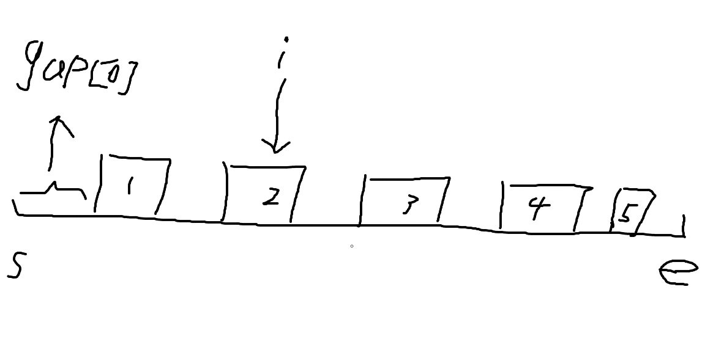

# [重新安排会议得到最多空余时间 II](https://leetcode.cn/problems/reschedule-meetings-for-maximum-free-time-ii/)

## 解题思路



1. 计算区间$[startTime, endTime]$之中所有会议的间隔
2. 对于第$i$个会议, 如果 $j > i \or j < i - 1, gap[j] >= 当前会议块长度$, 移动当前会议能够得到的最大长度为$gap[i] + g[i - 1] + 当前会议块长度$,  如果上面的条件都不满足(不能移动当前块到其他非相邻的块), 则移动当前会议能够得到的最大长度为$gap[i] + gap[i - 1]$

```cpp
using i32 = int;
using i64 = long long;
class Solution {
public:
    int maxFreeTime(int eventTime, vector<int>& startTime, vector<int>& endTime) {
        startTime.insert(startTime.begin(), 0);
        startTime.push_back(eventTime);

        endTime.insert(endTime.begin(), 0);

        i32 n = endTime.size();
        vector<i32> gap;
        for (int i = 1; i <= n; ++i)
            gap.push_back(startTime[i] - endTime[i - 1]);

        i32 size = gap.size();
        vector<i32> max_gap(size);
        max_gap[size - 1] = gap[n - 1];
        for (int i = size - 2; i >= 0; --i)
            max_gap[i] = max(max_gap[i + 1], gap[i]);

        i32 max_v = -1, max_len = 0, max_pre = -1;
        for (int i = 1; i < size; ++i) {
            i32 cur_v = gap[i] + gap[i - 1];

            i32 cur_block = endTime[i] - startTime[i];
            if ((i + 1 < size && max_gap[i + 1] >= cur_block) || (i > 1 && max_pre >= cur_block))
                cur_v += cur_block;

            max_v = max(max_v, cur_v);
            max_pre = max(max_pre, gap[i - 1]);
        }
        return max_v;
    }
};

```

