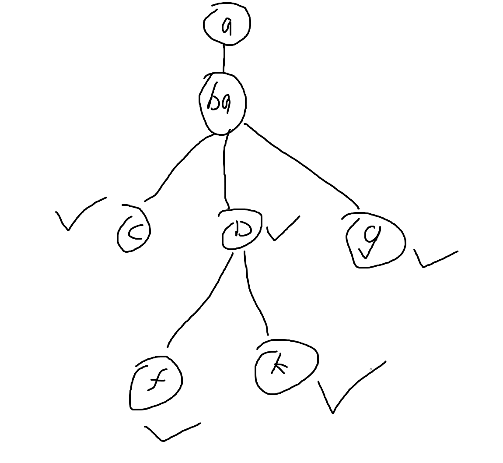

# [1233. 删除子文件夹](https://leetcode.cn/problems/remove-sub-folders-from-the-filesystem/)

## 解题思路

1. 将所有具有公共前缀的字符串都分为一组

2. 观察其中一组字符串, 注意到最后保留的字符串, 其公共路径上不存在其他已经结束的字符串

3. 根据2的观察能够使用字典树解决这个问题

   
   上图打钩表示有字符串以该结点结尾, 上图删除子文件之后得到的答案是$abac, abad, abag$


```cpp
struct Node {
    bool isEnd = false;
    map<string, Node*> next;
};

struct Trie {
    Node *root;

    Trie() {
        root = new Node();
    }

    void insert(const string &s) {
        Node *it = root;
        int n = s.size();

        int i = 0;
        while (i < n) {
            int j = s.find("/", i + 1);
            if (j == -1)
                j = n;

            string path = s.substr(i + 1, j - i - 1);
            if (!it->next.count(path))
                it->next[path] = new Node();;

            it = it->next[path];
            i = j;
        }
        it->isEnd = true;
    }

    string find(const string &s) {
        Node *it = root;
        int i = 0, n = s.size();

        string ans = "/";
        while (i < n) {
            int j = s.find("/", i + 1);
            if (j == -1)
                j = n;

            string path = s.substr(i + 1, j - i - 1);
            ans += path;
            it = it->next[path];

            if (it->isEnd)
                return ans;

            i = j;
            ans += "/";
        }
        return ans;
    }
};

class Solution {
public:
    vector<string> removeSubfolders(vector<string>& folder) {
        Trie trie;

        for (string &s : folder) 
            trie.insert(s);

        set<string> st;
        for (string s : folder) 
            st.insert(trie.find(s));

        vector<string> ans;
        for (string s: st) 
            ans.push_back(s);

        return ans;
    }
};

```
