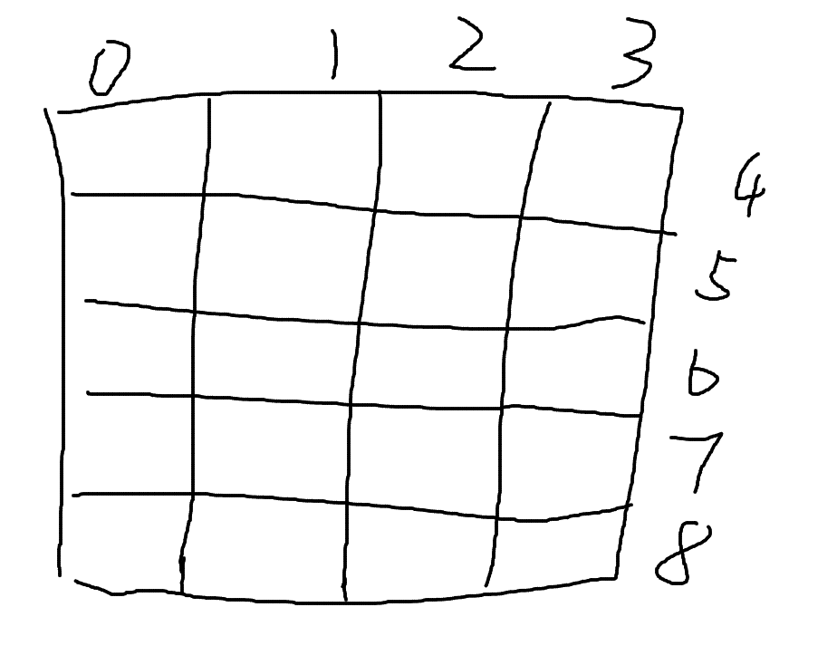

# [498. 对角线遍历](https://leetcode.cn/problems/diagonal-traverse/)

## 解题思路

1. 遍历顺序如下:

   

2. 纵坐标$x = max(i - m + 1, 0)$, 横坐标$y = min(i, m - 1)$

3. 构造一个标志位$flag$来标识本轮遍历是否需要翻转

```cpp
using i32 = int;
using i64 = long long;
using pii = pair<int, int>;
using pll = pair<i64, i64>;
const int mod = 1000000007, mod0 = 998244353;
class Solution {
public:
    vector<int> findDiagonalOrder(vector<vector<int>>& mat) {
        int n = mat.size(), m = mat[0].size();
        vector<int> ans;
        for (int i = 0, j = 1; i < n + m - 1; ++i, j = 1 - j) {
            vector<int> tmp;
            int x = max(0, i - m + 1), y = min(m - 1, i);

            while (x < n && y >= 0) {
                tmp.push_back(mat[x][y]);
                ++x;
                --y;
            }

            if (j == 1)
                reverse(tmp.begin(), tmp.end());
            for (int &v : tmp)
                ans.push_back(v);
        }
        return ans;
    }
};

```

