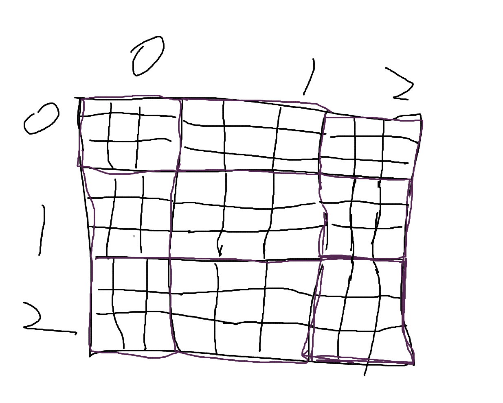

# [37. 解数独](https://leetcode.cn/problems/sudoku-solver/)

## 解题思路

1. 预处理出三个数组$col[i][j], row[i][j], box[i][j][k]$

   1. $col[i][j]$表示第$i$列是否存在$j$这个数

   2. $row[i][j]$表示第$i$行是否有$j$这个数

   3. $box[i][j][k]$表示第$i$行第$j$列的方块是否存在$k$这个数, 块编号如下图所示, 编号计算公式为$i = i_0 / 3, j = j_0 / 3$

      

2. 按照一个个空格顺序填充, 每次填充就是$[1, 9]$之中的数字, 在填充的过程中不能够违反游戏规则

```cpp
using i32 = int;
using i64 = long long;
using pii = pair<int, int>;
using pll = pair<i64, i64>;
const int mod = 1000000007, mod0 = 998244353;
class Solution {
    vector<vector<bool>> row, col;
    vector<vector<vector<bool>>> box;
    vector<pair<int, int>> spaces;

    bool dfs(vector<vector<char>> &b, int pos) {
        if (pos == spaces.size())
            return true;

        auto [i, j] = spaces[pos];
        for (int d = 1; d <= 9; ++d) {
            if (row[i][d] || col[j][d] || box[i / 3][j / 3][d])
                continue;

            b[i][j] = d + '0';
            row[i][d] = col[j][d] = box[i / 3][j / 3][d] = true;

            if (dfs(b, pos + 1))
                return true;

            row[i][d] = col[j][d] = box[i / 3][j / 3][d] = false;
            b[i][j] = '.';
        }
        return false;
    }

  public:
    void solveSudoku(vector<vector<char>> &board) {
        row = vector<vector<bool>>(10, vector<bool>(10));
        col = vector<vector<bool>>(10, vector<bool>(10));
        box = vector<vector<vector<bool>>>(10, vector<vector<bool>>(10, vector<bool>(10)));

        for (int i = 0; i < 9; ++i) {
            for (int j = 0; j < 9; ++j) {
                if (board[i][j] == '.') {
                    spaces.push_back({i, j});
                } else {
                    int v = board[i][j] - '0';
                    row[i][v] = true;
                    col[j][v] = true;
                    box[i / 3][j / 3][v] = true;
                }
            }
        }

        dfs(board, 0);
    }
};

```

