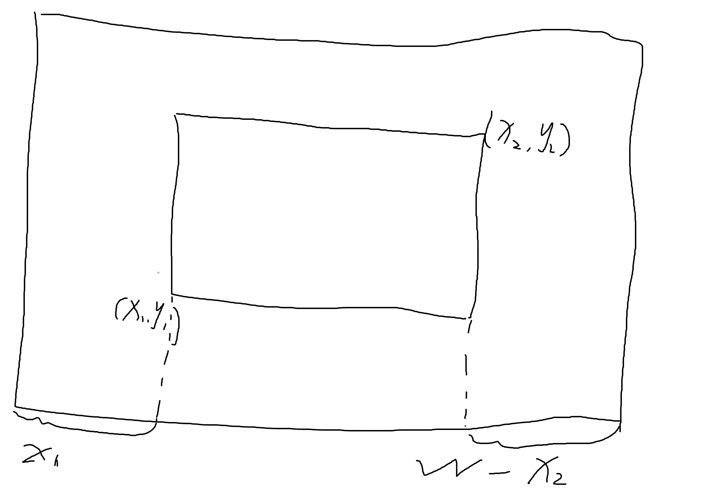

# [1555B - Two Tables](https://codeforces.com/problemset/problem/1555/B)

## 解题思路

1. 总是进行水平移动或者垂直移动, 这里以水平方向例
2. 当能够通过移动第一个桌子来容纳第二个桌子时, 总存在一个可行的矩形宽高分别为$w_0 = max(W - x2), h_0 = H$, 矩形存在的条件为$w + x_2 - x_1 \leq W$, 此时需要移动的最小距离为$max(0, w - d)$, 其中$d = max(w - x_2, x1)$.   总是向距离小的一边移动



## 参考代码

+ 时间复杂度$O(1)$


```cpp
#include <bits/stdc++.h>
using namespace std;

#define endl '\n'
#define rep(i, a, b) for (int i = a; i <= b; ++i)
#define erp(i, a, b) for (int i = a; i >= b; --i)

using i64 = long long;
using i32 = int;
using pii = pair<int, int>;
using pll = pair<i64, i64>;

const int mod = 1000000007, mod0 = 998244353;

void solve() {
    int W, H;
    cin >> W >> H;

    int x1, y1, x2, y2;
    cin >> x1 >> y1 >> x2 >> y2;

    int w, h;
    cin >> w >> h;

    int ans = INT_MAX;
    int d_w = max(W - x2, x1), d_h = max(H - y2, y1);
    if (w + x2 - x1 <= W) 
        ans = min(ans, max(0, w - d_w));

    if (h + y2 - y1 <= H)
        ans = min(ans, max(0, h - d_h));

    cout << (ans == INT_MAX ? -1 : ans) << endl;
}

int main() {
    ios::sync_with_stdio(0);
    cin.tie(0);
    cout.tie(0);
    int t;
    cin >> t;
    while (t-- > 0)
        solve();
    return 0;
}
```

