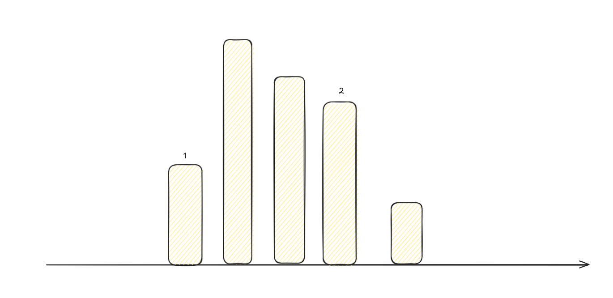

# [11. 盛最多水的容器](https://leetcode.cn/problems/container-with-most-water/)

## 解题思路

1. 盛水的容器由两个垂直线构成, 确定其中一条垂直线$height[i]$, 那么另外一条垂直线$height[j]$与$height[i]$有两种大小关系:

   1. $height[j] \geq height[i]$, 这种情况下能够盛水的容器高总是$height[i]$, 距离$height[i]$最远的那个垂直线与$height[i]$组成的容器可以容纳的水最多
   2. $height[j] \leq height[i]$, 这种情况下可以将原来的$i$看作$j$, $j$看作$i$转换为第一种情况处理

2. 观察$j \in [0, i - 1]$中所有$height[j] \geq height[i]$的垂直线, 可以发现只需要保留维持(从左到右)递增顺序的垂直线, 其他的垂直线都可以丢掉

   

上面这个图中只需要保留$1$和$2$, 其他的垂直线不会构成更优的解

3. 至此, 我们只需要顺序遍历数组, 并维护一个以$height[0]$递增的数组$inc$, 对于一个确定的$height[i]$, 在$inc$数组中找到满足$height[i] \le inc[j]$的最小$j$


## 参考代码

+ 时间复杂度$O(n \log n)$


```java
class Solution {
public:
    int f(vector<int>& height) {
        int n = height.size(), ans = 0;
        vector<int> inc;
        inc.push_back(0);
        for (int i = 1; i < n; ++i) {
            int pos = lower_bound(inc.begin(), inc.end(), height[i], [&](int x, int v){
                return height[x] < v;
            }) - inc.begin();
            if (pos != inc.size()) 
                ans = max(ans, (i - inc[pos]) * height[i]);
                
            if (height[i] > height[inc.back()])
                inc.push_back(i);
        }
        return ans;
    }
    int maxArea(vector<int>& height) {
        int ans = f(height);
        reverse(height.begin(), height.end());
        return max(ans, f(height));
    }
};

```

