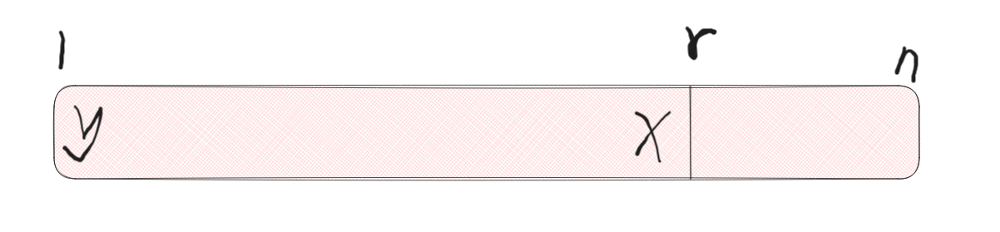

# [D - Flipper ](https://codeforces.com/contest/1833/problem/D)

## 解题思路

+ 经过操作之后, 最优解第一个位置上的数一定是$n \or n - 1$. 只有在应用操作之前第一个位置是$n$, 最优解第一个位置上才的数是$n - 1$, 其他情况都是$n$. 因为在没有应用操作之前第一个数属于区间$[l, r] \or [1, l - 1]$这两个区间的操作都会让第一个位置上的数后移

+ 让$mx = arr[1] = n ? n - 1 : n$, $p[j] = mx$

+ 区间右端点$r$的选值有两种情况: $r = n$ 或 $r = j$, 当$mx$不在最后一个位置上时$r$的选值只有一种情况$r = j - 1$

  + 先分析$r = j$的情况, 让$x = p[r], y = p[1]$ 此时的局面如下:

    

    数组的后$r$个数为$x, y\cdots ,p[r - 1]$(先假设$l = r$), 可以发现当$p[x - 1] > y$时能够左移$l$得到一个更优的解$x, p[r - 1], y\cdots ,p[r - 2]$ , 不断的尝试左移直到不能够移动为止, 这个时候得到的解就是最优解

  + 再分析$r = n$的情况, 这种情况有可能构造出比$r = j$构造的数组更优的数组, 即选择区间为$[1, l - 1] = [1, n - 1] \and [l, r] = [n, n]$, 操作后的的数组为: $p[n], y, \cdots x$, 当$y > x$的时候, 比构造的数组比之前构造的更优. 选择区间为$[l, r] = [1, n]$时, 操作后的数组为: $p[n],x \cdots y$, 这种情况包含在之前的构造之中


## 参考代码

+ 时间复杂度$O(n)$


```cpp
#include <bits/stdc++.h>
using namespace std;

#define endl '\n'
#define rep(i, a, b) for (int i = a; i <= b; ++i)
#define erp(i, a, b) for (int i = a; i >= b; --i)

using i32 = int;
using i64 = long long;
using pii = pair<int, int>;
using pll = pair<i64, i64>;

const int mod = 1000000007, mod0 = 998244353;

void solve() {
    int n;
    cin >> n;
    vector<int> arr(n + 1);
    rep (i, 1, n)
        cin >> arr[i];

    if (n == 1) {
        cout << arr[1] << endl;
        return;
    }

    int first_v = arr[1] == n ? n - 1 : n;
    if (arr[n] == first_v && arr[1] > arr[n - 1]) {
        cout << arr[n] << " ";
        rep (i, 1, n - 1)
            cout << arr[i] << " ";
        cout << endl;
        return;
    }

    int r = n - 1;
    erp(i, n, 2) {
        if (arr[i] == first_v) {
            r = i - 1;
            break;
        }
    }

    int l = r;
    while (l > 1 && arr[l - 1] > arr[1])
        --l;

    rep (i, r + 1, n)
        cout << arr[i] << " ";
    erp (i, r, l)
        cout << arr[i] << " ";
    rep (i, 1, l - 1)
        cout << arr[i] << " ";
    cout << endl;
}

int main() {
    ios::sync_with_stdio(0);
    cin.tie(0);
    cout.tie(0);
    int t;
    cin >> t;
    while (t-- > 0)
        solve();
    return 0;
}

```
