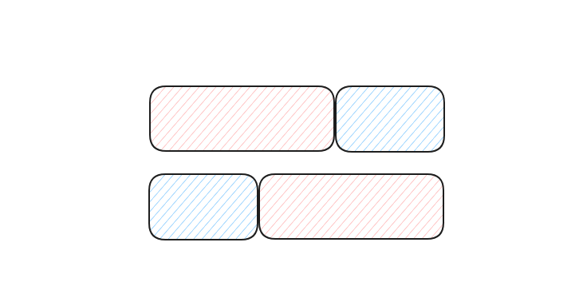

# [61. 旋转链表](https://leetcode.cn/problems/rotate-list/)

## 解题思路

1. 计算当前链表有多少个节点

2. 计算第一个节点移动之后的位置$pos$. $pos$之后的所有节点都会被移动到开头, 类似下图的蓝色部分:

   

## 参考代码

+ 时间复杂度$O(n)$


```cpp
using i64 = long long;
class Solution {
public:
    ListNode* rotateRight(ListNode* head, int k) {
        int n = 0;
        ListNode *it = head, *tail;
        while (it != nullptr) {
            ++n;
            if (it->next == nullptr)
                tail = it;
            it = it->next;
        }
        if (n == 0)
            return head;
        k %= n;
        if (k == 0)
            return head;
        // k in [1, n - 1]
        ListNode *ans;
        int jump_num = n - 1 - k;
        it = head;
        while (jump_num > 0) {
            it = it->next;
            --jump_num;
        }
        ans = it->next;

        ListNode *pre = it;
        it = it->next;
        pre->next = nullptr;
        tail->next = head;
        return ans;
    }
};

```
